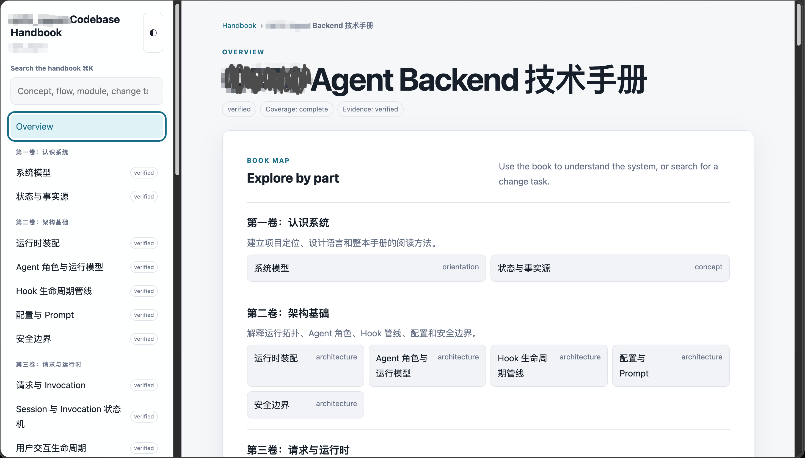

# ALuSkills

让 Coding Agent 不只会生成代码，也能更可靠地完成软件开发中的关键工程工作。

ALuSkills 是一组面向真实代码库的 Agent Skills，覆盖从需求进入开发，到方案落地、代码审查、长任务恢复和知识沉淀的完整工作流：

```text
模糊需求 → 开发简报 → 技术规格 → 实现与审查 → 任务恢复 → 代码库手册
```

它们强调：

- **基于仓库事实工作**：先阅读相关代码、测试和文档，再给出结论；
- **产出可检查的文件**：将需求、设计、审查结果和任务状态持久化，而不是只留在对话中；
- **覆盖困难路径**：关注失败、恢复、并发、兼容性、安全和外部副作用；
- **按需触发**：简单任务保持简单，不为低风险修改强行增加流程。

这些 Skills 遵循 [Agent Skills 规范](https://agentskills.io/specification)，可以通过 [`skills`](https://github.com/vercel-labs/skills) CLI 安装到 Codex、Claude Code、Cursor 等兼容的 Agent。

## 1. 安装

安装由 [`skills`](https://github.com/vercel-labs/skills) CLI 完成，需要本机已经安装 Node.js 和 `npx`。

### 1.1 查看可用 Skills

以下命令只查看，不会安装：

```bash
npx skills add ChengsongLu/ALuSkills --list
```

确认来源为 `ChengsongLu/ALuSkills`，并显示 5 个 skills。

### 1.2 全局安装全部 Skills

推荐首次安装使用交互模式：

```bash
npx skills add ChengsongLu/ALuSkills --skill '*' --global
```

安装时只需关注以下步骤：

1. **选择 Agent**

   使用 `↑`、`↓` 移动，`Space` 选择，`Enter` 确认。

   - Codex、Cursor：包含在 `Universal (.agents/skills)` 中，无需额外选择；
   - Claude Code：在 `Additional agents` 中额外选择 `Claude Code`；
   - 不要选择自己不用的 Agent，避免创建无关目录或链接。

2. **检查安装摘要**

   应看到 5 个 skills 安装到 `~/.agents/skills/`。摘要中的 `copy → Codex ...` 表示这些 Agent 可以读取通用副本，是正常结果。

   如果需要 Claude Code，还应确认摘要中包含 `Claude Code`；如果没有，选择 `No` 并重新运行安装。

3. **确认安装**

   在 `Proceed with installation?` 处选择 `Yes`，按 `Enter` 完成安装。

安装完成后重新启动 Agent，或新建一个会话。

### 1.3 直接指定 Agent

跳过交互，安装给 Codex：

```bash
npx skills add ChengsongLu/ALuSkills --skill '*' --global --agent codex --yes
```

安装给 Claude Code：

```bash
npx skills add ChengsongLu/ALuSkills --skill '*' --global --agent claude-code --yes
```

安装给 Cursor：

```bash
npx skills add ChengsongLu/ALuSkills --skill '*' --global --agent cursor --yes
```

同时安装给三者：

```bash
npx skills add ChengsongLu/ALuSkills --skill '*' --global \
  --agent codex --agent claude-code --agent cursor --yes
```

### 1.4 安装位置

| Agent | 项目级目录 | 全局目录 |
| --- | --- | --- |
| Codex | `.agents/skills/` | `~/.codex/skills/` |
| Claude Code | `.claude/skills/` | `~/.claude/skills/` |
| Cursor | `.agents/skills/` | `~/.cursor/skills/` |

CLI 可能将公共副本放在 `~/.agents/skills/`，再由 Agent 直接读取或建立链接；以 `Installation Summary` 显示的路径为准。

### 1.5 更新

更新已经全局安装的 ALuSkills：

```bash
npx skills update --global \
  clarify-development-request \
  write-technical-spec \
  review-code-changes \
  maintain-task-checkpoints \
  codebase-handbook
```

该命令只更新列出的 5 个 skills。若希望更新所有来源的全局 skills，可以使用：

```bash
npx skills update --global
```

更新完成后重新启动 Agent，或新建一个会话，使新的 Skill 内容和触发规则生效。

### 1.6 验证

```bash
npx skills list --global
```

输出中应能看到本仓库的 5 个 skills。

## 2. Skills

| Skill | 解决的问题 | 关键产物 |
| --- | --- | --- |
| [`clarify-development-request`](skills/clarify-development-request/) | 把会影响实现方向的模糊需求澄清完整 | `brief.md` |
| [`write-technical-spec`](skills/write-technical-spec/) | 评估任务是否需要技术规格，确认后转化为与仓库一致的方案 | 可选 `flow.md`、`design.md`、`implement.md` |
| [`review-code-changes`](skills/review-code-changes/) | 从具体变更中发现正确性、可靠性和安全风险 | `review.md`、`coverage.md` |
| [`maintain-task-checkpoints`](skills/maintain-task-checkpoints/) | 让复杂任务在中断、压缩或交接后安全继续 | `STATE.md`、`CHECKPOINTS.md` |
| [`codebase-handbook`](skills/codebase-handbook/) | 将代码库设计与运行行为沉淀成可维护的技术书 | Markdown 章节、`manifest.yaml`、`handbook.html` |

### 2.1 clarify-development-request

在非简单开发开始前调查相关代码、测试和文档，只追问真正会改变产品行为、契约、范围或验收结果的问题。它先进行不落盘的轻量判定；机械修改、明确的低风险任务和仅涉及局部实现选择的工作会直接退出，不创建 `brief.md`。只有确认存在实质未决决策后，才进入完整澄清流程并形成可确认、可交接的开发简报。

适合：

- 将“一句话需求”整理成实现就绪的 brief；
- 明确目标、范围、非目标和验收标准；
- 澄清状态、失败语义、兼容性、安全和副作用边界；
- 在进入技术设计前消除会改变方案的未决问题。

不适合普通咨询、纯诊断、纯审查、机械修改，或已经足够明确的低风险任务。

**关键产物**

```text
.clarify-development-request/
└── 2026_07_29_export-orders_000/
    └── brief.md
```

`brief.md` 示例：

```markdown
# Export orders

## Goal and success criteria
- 用户可以导出当前筛选结果，而不是全部订单。
- 10,000 条以内的导出请求在 30 秒内完成。

## Scope
- 支持 CSV；本次不支持 XLSX。
- 沿用现有订单查询权限和筛选条件。

## Failure behavior
- 导出失败时不生成不完整文件，并向用户返回可重试提示。

## Acceptance
- 覆盖空结果、权限不足、超量和生成失败场景。
```

安装：

```bash
npx skills add ChengsongLu/ALuSkills --skill clarify-development-request --global
```

### 2.2 write-technical-spec

先根据当前仓库证据和任务的实际复杂度判断是否值得进入技术规格流程，说明理由并请用户确认。确认进入后，再根据参与者、边界、异步状态、分支、失败与恢复路径等流程复杂度建议是否创建独立 `flow.md`，由用户再次确认文档集合；两道确认完成前不会创建规格文件。随后把核心流程、设计决策和具体实施拆到正确的文档层级，覆盖模块边界、接口、数据与状态、迁移、兼容性、失败恢复、安全和测试策略。

适合：

- 编写技术方案或设计文档；
- 用 Mermaid 绘制正常与异常处理流程；
- 规划模块、接口、数据、状态和兼容性变化；
- 制定分阶段实施计划和验证策略；
- 审查已有设计是否完整且与仓库一致。

**关键产物**

```text
.write-technical-spec/
└── 2026_07_29_export_orders_000/
    ├── flow.md       # 可选：流程和关键分支
    ├── design.md     # 设计边界、契约和决策
    └── implement.md  # 分阶段改动与验证计划
```

`design.md` 示例：

```markdown
## Design

- `OrderExportService` 接收已授权的查询条件，不重新实现权限判断。
- 查询使用只读分页游标，逐批写入临时文件，成功后再原子发布。
- 任一批次失败时删除临时文件，不返回部分导出结果。

## Compatibility

- 现有订单查询 API 保持不变。
- 新增的导出接口沿用当前筛选参数格式。
```

安装：

```bash
npx skills add ChengsongLu/ALuSkills --skill write-technical-spec --global
```

### 2.3 review-code-changes

针对工作区 diff、暂存修改、指定 commit、分支比较或 PR 进行证据驱动的代码审查。小型、低风险且无需持久化的审查直接在对话中交付；正式审查、PR/分支就绪性检查以及大型或高风险变更才创建 `review.md`。两种模式都会从契约和对抗性失败角度检查正确性、可靠性、安全性、兼容性、测试和文档风险。

适合：

- 审查当前未提交修改；
- 审查指定 commit 或分支差异；
- 检查状态、并发、持久化、重试、取消和失败恢复路径；
- 输出带证据、影响级别和修复方向的审查结果；
- 在用户明确授权后修复已确认的问题。

默认只审查、不修改实现文件。

**关键产物**

```text
.review-code-changes/
└── 2026_07_29_working-tree_000/
    ├── review.md       # 已确认的 findings 和总体结论
    └── coverage.md     # 大型或高风险审查的覆盖记录
```

`review.md` 示例：

```markdown
## [P1] 发布完成前不能暴露导出文件

`export_orders.py:84` 在最后一批数据写入前就把下载地址保存到数据库。
并发下载可能读取到不完整 CSV；进程崩溃后该地址也会永久指向半成品。

建议先写入临时路径，关闭并校验文件后再原子移动，并在同一提交点更新下载状态。
```

安装：

```bash
npx skills add ChengsongLu/ALuSkills --skill review-code-changes --global
```

### 2.4 maintain-task-checkpoints

为长时间、多阶段或高恢复成本的开发任务维护紧凑的恢复状态。它记录已经确认的决策、当前进度、文件变化、验证结果、剩余风险和不可重复的副作用，让任务在会话中断、上下文压缩或 Agent 交接后安全继续。

适合：

- 跨多个模块和阶段的复杂开发；
- 包含迁移、状态机、并发或外部副作用的任务；
- 需要在不同 Agent 之间交接的工作；
- 容易因中断而重复危险操作的任务；
- 用户明确要求保存检查点的任务。

短小、低风险、单次即可完成的任务不应创建检查点。

**关键产物**

```text
.maintain-task-checkpoints/
└── 20260729-143000-export-orders/
    ├── STATE.md        # 当前可恢复状态
    └── CHECKPOINTS.md  # 追加式阶段历史
```

`STATE.md` 示例：

```markdown
## Current state

- Status: in_progress
- Completed: 导出查询与 CSV 流式写入
- Current: 实现临时文件的原子发布
- Next: 补充失败注入测试和 10,000 条性能验证

## Validation

- Passed: 单元测试 18/18
- Pending: 进程中断后的临时文件清理测试

## Do not repeat

- 测试环境数据库迁移已经执行，不要再次创建同名索引。
```

安装：

```bash
npx skills add ChengsongLu/ALuSkills --skill maintain-task-checkpoints --global
```

### 2.5 codebase-handbook

在仓库中创建和维护 `.codebase-handbook/` 技术手册。它以“技术书”而不是逐文件 API 清单的方式，解释稳定概念、模块职责、运行流程、状态变化、失败行为、系统关系和对应的源码证据。机械修改、测试专属修改和局部行为保持不变的修改默认不触发完整同步；当仓库规则要求检查时，只做路径与引用匹配的轻量影响判定，没有实质影响就不改手册、不重建 HTML。

适合：

- 初始化代码库技术手册；
- 导航和理解已有手册；
- 在代码变更前后同步架构与行为说明；
- 校验手册结构、引用和覆盖范围；
- 生成可视化友好、自包含的 HTML 阅读视图；
- 拆分、合并或演进手册章节。

**关键产物**

```text
.codebase-handbook/
├── index.md
├── manifest.yaml
├── architecture/
│   └── system-overview.md
├── flows/
│   └── order-export.md
└── handbook.html
```

章节示例：

```markdown
# Order export flow

当修改订单查询、权限校验、文件存储或下载状态时阅读本章。

## Normal runtime path
1. API 层验证用户权限并规范化筛选条件。
2. Export Service 分页读取订单并写入临时 CSV。
3. 文件完整关闭后原子发布，并将任务标记为 ready。

## Failure and recovery
- 发布前失败：删除临时文件，任务进入 failed。
- 发布后状态更新失败：恢复任务扫描存储结果并收敛数据库状态。

## Source evidence
- `src/orders/export_service.py::OrderExportService`
- `src/jobs/export_orders.py::run_export`
```

`handbook.html` 由 Markdown 章节和 `manifest.yaml` 生成，是一个无需本地服务器即可直接打开的自包含页面。它提供书籍式目录树、全文搜索、面包屑、章节内目录、前后章与相关主题导航、可折叠源码证据、明暗主题和响应式布局，适合开发者浏览，也保留供 Agent 定位任务所需的结构化信息。

**`handbook.html` 示例**



桌面布局将目录与全文搜索固定在左侧，正文区域展示手册状态、覆盖度、证据状态和按卷组织的章节地图；同一个自包含文件也支持明暗主题与窄屏阅读。

该 skill 不会因为普通编码任务而自动初始化手册；初始化需要用户明确提出。

安装：

```bash
npx skills add ChengsongLu/ALuSkills --skill codebase-handbook --global
```

## 3. 目录结构

每个 skill 都是一个独立目录，并至少包含一个带 YAML frontmatter 的 `SKILL.md`：

```text
skills/
├── clarify-development-request/
├── codebase-handbook/
├── maintain-task-checkpoints/
├── review-code-changes/
└── write-technical-spec/
```

部分 skills 还包含 `scripts/`、`references/`、`assets/` 或 `agents/openai.yaml`。安装时这些依赖会和对应的 `SKILL.md` 一起复制或链接到目标 Agent 的 skills 目录。

## 4. 开源协议

本项目采用 [Apache License 2.0](LICENSE) 开源。

Copyright 2026 Chengsong Lu.
